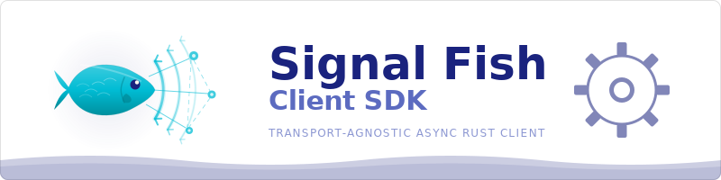

<p align="center">
  
</p>

<p align="center">
  <a href="https://crates.io/crates/signal-fish-client">
    
  </a>
  <a href="https://docs.rs/signal-fish-client">
    
  </a>
  <a href="https://github.com/Ambiguous-Interactive/signal-fish-client-rust/actions/workflows/ci.yml">
    
  </a>
  <a href="https://blog.rust-lang.org/2025/02/20/Rust-1.85.0.html">
    
  </a>
  <a href="LICENSE">
    
  </a>
</p>

Transport-agnostic async Rust client for the **Signal Fish** multiplayer signaling protocol. Connect to a Signal Fish server over any bidirectional transport, authenticate, join rooms, and receive strongly-typed events — all through a simple channel-based API.

## Features

- **Transport-agnostic** — implement the `Transport` trait for any backend (WebSocket, TCP, QUIC, WebRTC data channels, etc.)
- **Wire-compatible** — all protocol types match the Signal Fish server's v2 JSON format exactly
- **Feature-gated WebSocket transport** — the default `transport-websocket` feature provides a ready-to-use `WebSocketTransport`
- **Event-driven** — receive typed `SignalFishEvent`s via a Tokio MPSC channel
- **Structured errors** — `SignalFishError` (9 variants) and `ErrorCode` (40 variants) for precise error handling
- **Full protocol coverage** — 11 client message types, 24 server message types, 26 event variants

## Installation

```toml
[dependencies]
signal-fish-client = "0.1"
```

Without the built-in WebSocket transport (bring your own):

```toml
[dependencies]
signal-fish-client = { version = "0.1", default-features = false }
```

## Quick Start

```rust,no_run
use signal_fish_client::{
    WebSocketTransport, SignalFishClient, SignalFishConfig,
    JoinRoomParams, SignalFishEvent,
};

#[tokio::main]
async fn main() -> Result<(), signal_fish_client::SignalFishError> {
    // 1. Connect a WebSocket transport to the signaling server.
    let transport = WebSocketTransport::connect("ws://localhost:3536/ws").await?;

    // 2. Build a client config with your application ID.
    let config = SignalFishConfig::new("mb_app_abc123");

    // 3. Start the client — returns a handle and an event receiver.
    //    The client automatically sends Authenticate on start.
    let (mut client, mut event_rx) = SignalFishClient::start(transport, config);

    // 4. Process events — wait for Authenticated before joining a room.
    while let Some(event) = event_rx.recv().await {
        match event {
            SignalFishEvent::Authenticated { app_name, .. } => {
                println!("Authenticated as {app_name}");
                // Now it's safe to join a room.
                client.join_room(JoinRoomParams::new("my-game", "Alice"))?;
            }
            SignalFishEvent::RoomJoined { room_code, .. } => {
                println!("Joined room {room_code}");
            }
            SignalFishEvent::Disconnected { .. } => break,
            _ => {}
        }
    }

    // 5. Shut down gracefully.
    client.shutdown().await;
    Ok(())
}
```

## Feature Flags

| Feature               | Default | Description                                                             |
| --------------------- | ------- | ----------------------------------------------------------------------- |
| `transport-websocket` | **yes** | Built-in WebSocket transport via `tokio-tungstenite` and `futures-util` |

## Architecture

| Module        | Purpose                                                           |
| ------------- | ----------------------------------------------------------------- |
| `client`      | `SignalFishClient` handle, `SignalFishConfig`, `JoinRoomParams`   |
| `event`       | `SignalFishEvent` enum (24 server + 2 synthetic variants)         |
| `protocol`    | Wire-compatible `ClientMessage` (11) / `ServerMessage` (24) types |
| `error`       | `SignalFishError` unified error type (9 variants)                 |
| `error_codes` | `ErrorCode` enum (40 server error code variants)                  |
| `transport`   | `Transport` trait for pluggable backends                          |
| `transports`  | Built-in transport implementations (`WebSocketTransport`)         |

## Examples

### Basic Lobby

Full lifecycle: connect, authenticate, join a room, handle events, and shut down gracefully with Ctrl+C support.

```sh
cargo run --example basic_lobby

# Override the server URL:
SIGNAL_FISH_URL=ws://my-server:3536/ws cargo run --example basic_lobby
```

See [`examples/basic_lobby.rs`](examples/basic_lobby.rs).

### Custom Transport

Implement a channel-based loopback transport, wire it into the client, and verify events flow correctly — no network required.

```sh
cargo run --example custom_transport
```

See [`examples/custom_transport.rs`](examples/custom_transport.rs).

## Custom Transport

Implement the `Transport` trait to plug in any I/O backend:

```rust,ignore
use async_trait::async_trait;
use signal_fish_client::{SignalFishError, Transport};

struct MyTransport { /* … */ }

#[async_trait]
impl Transport for MyTransport {
    async fn send(&mut self, message: String) -> Result<(), SignalFishError> {
        // Send the JSON text message over your transport.
        todo!()
    }

    async fn recv(&mut self) -> Option<Result<String, SignalFishError>> {
        // Receive the next JSON text message.
        // Return None when the connection is closed cleanly.
        todo!()
    }

    async fn close(&mut self) -> Result<(), SignalFishError> {
        // Gracefully shut down the connection.
        todo!()
    }
}
```

Key requirements:

- `recv()` **must** be cancel-safe (it's used inside `tokio::select!`)
- Connection setup happens *before* constructing the transport — the trait only covers message I/O
- The transport must be `Send + 'static` (required by the async task boundary)

## Development

### Run CI Locally

A unified script runs all CI checks locally:

```sh
# Run all checks (matches CI exactly)
bash scripts/check-all.sh

# Quick mode: fmt + clippy + test only
bash scripts/check-all.sh --quick
```

### Mandatory baseline

```sh
cargo fmt && cargo clippy --all-targets --all-features -- -D warnings && cargo test --all-features
```

### Additional quality checks

| Command | CI Workflow | Install |
| ------- | ----------- | ------- |
| `cargo deny check` | ci.yml | `cargo install cargo-deny` |
| `cargo audit` | security-supply-chain.yml | `cargo install cargo-audit` |
| `bash scripts/check-no-panics.sh` | no-panics.yml | (built-in) |
| `typos` | docs-validation.yml | `cargo install typos-cli` |
| `markdownlint-cli2 "**/*.md"` | docs-validation.yml | `npm install -g markdownlint-cli2` |
| `lychee --config .lychee.toml "**/*.md"` | docs-validation.yml | `cargo install lychee` |
| `cargo machete` | unused-deps.yml | `cargo install cargo-machete` |
| `cargo semver-checks check-release` | semver-checks.yml | `cargo install cargo-semver-checks` |
| `bash scripts/check-workflows.sh` | workflow-lint.yml | (built-in) |
| `cargo +nightly miri test --test protocol_tests` | deep-safety.yml | `rustup component add miri --toolchain nightly` |
| `cd fuzz && cargo +nightly fuzz run ...` | deep-safety.yml | `cargo install cargo-fuzz` |
| `cargo mutants --file src/protocol.rs ...` | deep-safety.yml | `cargo install cargo-mutants` |
| `cargo llvm-cov --all-features --summary-only` | coverage.yml | `cargo install cargo-llvm-cov` + `rustup component add llvm-tools-preview` |

## Minimum Supported Rust Version (MSRV)

<!-- markdownlint-disable-next-line MD036 -->
**1.85.0**

Tested against the latest stable Rust and the declared MSRV. Bumping the MSRV is considered a minor version change.

## License

[MIT](LICENSE) — Copyright (c) 2025-2026 Ambiguous Interactive
