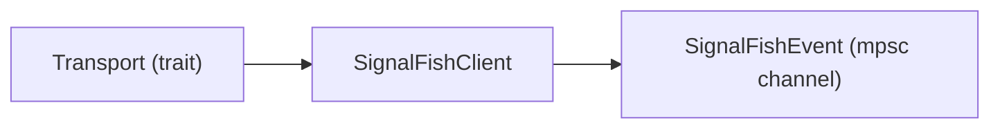
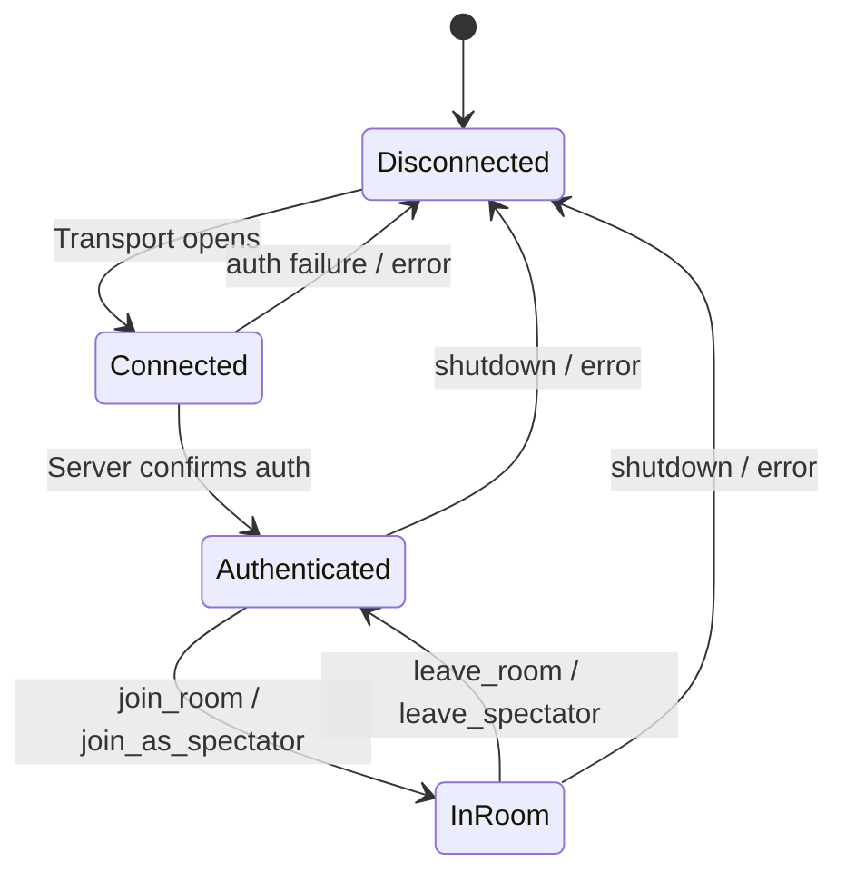
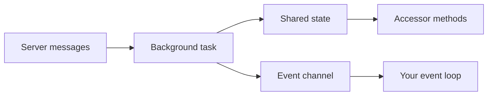

# Core Concepts

This page explains the foundational ideas behind the Signal Fish Client SDK.
Understanding these concepts will help you use the SDK effectively and debug
issues when they arise.

---

## Transport-Agnostic Design

The SDK separates **networking** from **client logic** through the `Transport`
trait. `SignalFishClient` never knows (or cares) whether it is talking over a
WebSocket, a raw TCP socket, a QUIC stream, or even an in-memory test loopback.



The `Transport` trait defines three async methods — send, receive, and close:

```rust
#[async_trait]
pub trait Transport: Send + 'static {
    async fn send(&mut self, message: String) -> Result<(), SignalFishError>;
    async fn recv(&mut self) -> Option<Result<String, SignalFishError>>;
    async fn close(&mut self) -> Result<(), SignalFishError>;
}
```

| Method | Purpose |
|--------|---------|
| `send` | Transmit one serialized JSON message to the server. |
| `recv` | Receive the next JSON message. Returns `None` on clean close. **Must be cancel-safe.** |
| `close` | Gracefully shut down the underlying connection. |

!!! tip "Bring your own transport"
    Connection setup is intentionally **not** part of the trait. Different
    transports have different connection parameters (URLs, host:port, QUIC
    endpoints, etc.). Construct a connected transport externally, then hand it
    to `SignalFishClient::start`.

The crate ships with a ready-made `WebSocketTransport` (behind the `transport-websocket`
feature flag), but you can implement the trait for any medium.

---

## Client Lifecycle

`SignalFishClient` follows a linear state machine. Every session progresses
through the same states:



| Transition | Trigger |
|------------|---------|
| **Disconnected → Connected** | `SignalFishClient::start` spawns the background task and emits `SignalFishEvent::Connected`. |
| **Connected → Authenticated** | The SDK auto-sends an `Authenticate` message. On success the server replies and `SignalFishEvent::Authenticated` is emitted. |
| **Authenticated → InRoom** | Call `client.join_room(params)` or `client.join_as_spectator(...)`. The server responds with `SignalFishEvent::RoomJoined` (or `SpectatorJoined`). |
| **InRoom → Authenticated** | Call `client.leave_room()` or `client.leave_spectator()`. The server confirms with `SignalFishEvent::RoomLeft`. |
| **Any → Disconnected** | Call `client.shutdown().await`, drop the client, or encounter an unrecoverable transport error. `SignalFishEvent::Disconnected` is always the final event. |

!!! warning "Authentication is automatic"
    You do **not** need to call an authenticate method. `SignalFishClient::start`
    sends the authentication message immediately using the `SignalFishConfig`
    you provide.

---

## Event-Driven Architecture

All server responses arrive as `SignalFishEvent` variants on a **bounded
`mpsc::Receiver<SignalFishEvent>`** (default capacity 256, configurable via
`SignalFishConfig::event_channel_capacity`). Your application consumes
them in an async loop:

```rust
let config = SignalFishConfig::new("mb_app_abc123");
let (client, mut events) = SignalFishClient::start(transport, config);

while let Some(event) = events.recv().await {
    match event {
        SignalFishEvent::Connected => {
            println!("Transport connected, awaiting auth…");
        }
        SignalFishEvent::Authenticated { app_name, .. } => {
            println!("Authenticated as {app_name}");
        }
        SignalFishEvent::RoomJoined { room_code, current_players, .. } => {
            println!("Joined room {room_code} with {} players", current_players.len());
        }
        SignalFishEvent::Disconnected { reason } => {
            println!("Disconnected: {reason:?}");
            break;
        }
        _ => {}
    }
}
```

### Synthetic vs. Server Events

Most events correspond 1:1 to a server message. Two **synthetic** events are
generated locally by the transport layer:

| Event | Origin |
|-------|--------|
| `SignalFishEvent::Connected` | Emitted when the transport opens, before any server message. |
| `SignalFishEvent::Disconnected { reason }` | Emitted when the transport closes or errors. Always the last event. |

!!! warning "Channel capacity"
    The event channel has a default capacity of **256** (configurable via
    `SignalFishConfig::event_channel_capacity`). If your consumer falls behind,
    events are **dropped** (with a warning logged) to avoid blocking the
    transport loop. The `Disconnected` event is the exception — it is always
    delivered. Design your event loop to stay responsive to avoid losing events.

---

## Non-Blocking Command Sending

All client command methods — `join_room`, `leave_room`, `send_game_data`,
`set_ready`, `request_authority`, `provide_connection_info`, `reconnect`,
`join_as_spectator`, `leave_spectator`, `ping` — are **synchronous**. They
serialize a `ClientMessage`, queue it on an internal unbounded channel, and
return `Result<()>` immediately. There is no `.await`.

```rust
// These return instantly — no network round-trip
client.join_room(
    JoinRoomParams::new("my-game", "Alice")
        .with_max_players(4),
)?;

client.send_game_data(serde_json::json!({ "action": "move", "x": 10 }))?;

client.set_ready()?;
```

Besides the state accessors, the **only** async method on the client is `shutdown()`:

```rust
client.shutdown().await;
```

### State Accessors

| Accessor | Async? | Returns |
|----------|--------|---------|
| `is_connected()` | No | `bool` |
| `is_authenticated()` | No | `bool` |
| `current_player_id()` | Yes (`async`) | `Option<PlayerId>` |
| `current_room_id()` | Yes (`async`) | `Option<RoomId>` |
| `current_room_code()` | Yes (`async`) | `Option<String>` |

The synchronous accessors use `AtomicBool` internally. The async accessors use
a `tokio::sync::Mutex` because they guard heap-allocated optional state.

---

## State Management

The SDK maintains internal state that is updated by the background transport
loop as server messages arrive:

| Field | Type | Updated when |
|-------|------|-------------|
| `connected` | `AtomicBool` | Transport opens / closes |
| `authenticated` | `AtomicBool` | `Authenticated` event received |
| `player_id` | `Mutex<Option<PlayerId>>` | `RoomJoined` / `Reconnected` / `SpectatorJoined` |
| `room_id` | `Mutex<Option<RoomId>>` | `RoomJoined` / `RoomLeft` / `Reconnected` / `SpectatorJoined` / `SpectatorLeft` |
| `room_code` | `Mutex<Option<String>>` | `RoomJoined` / `RoomLeft` / `Reconnected` / `SpectatorJoined` / `SpectatorLeft` |

State flows **one direction**: the background task writes, your code reads
through the accessors. You never set state directly.



!!! note
    State updates happen *before* the corresponding event is emitted on the
    channel. By the time you receive `SignalFishEvent::RoomJoined`,
    `client.current_room_id().await` already returns `Some(...)`.

---

## Graceful Shutdown

To stop the client cleanly, call `shutdown()`:

```rust
client.shutdown().await;
```

Under the hood this:

1. Sends a signal to the background transport loop via a `oneshot` channel.
2. The loop calls `transport.close()` and emits `SignalFishEvent::Disconnected`.
3. `shutdown()` awaits the background task with a configurable timeout (default
   **1 second**, set via `SignalFishConfig::shutdown_timeout`). If the task does
   not finish in time, it is abandoned (but still runs to completion in the
   background).

### Drop Fallback

If `shutdown()` is never called and the `SignalFishClient` is dropped, the
`Drop` implementation **aborts** the background task immediately. This is a
last-resort cleanup — always prefer an explicit `shutdown().await` so that the
server receives a clean close and `Disconnected` is emitted.

!!! warning
    `Drop` cannot run async code. It calls `task.abort()`, which cancels the
    future without executing `transport.close()`. The server may see an
    unclean disconnection.

---

## Error Handling Model

Errors are split into two layers depending on where they originate.

### Client-Side: `SignalFishError`

`SignalFishError` covers transport and local failures. These are returned
directly from client methods as `Result<(), SignalFishError>`.

| Variant | Meaning |
|---------|---------|
| `TransportSend(String)` | Failed to write to the transport. |
| `TransportReceive(String)` | Failed to read from the transport. |
| `TransportClosed` | The transport connection closed unexpectedly. |
| `Serialization(serde_json::Error)` | JSON serialization / deserialization failed. |
| `NotConnected` | Attempted an operation without an active connection. |
| `NotInRoom` | Attempted a room operation without being in a room. |
| `ServerError { message, error_code }` | The server returned an error; `error_code` is `Option<ErrorCode>` and may be absent. |
| `Timeout` | An operation exceeded its time limit. |
| `Io(std::io::Error)` | An underlying I/O error occurred. |

### Server-Side: `ErrorCode`

`ErrorCode` is a 40-variant enum that arrives inside events. The server sends
these as `SCREAMING_SNAKE_CASE` strings (e.g., `"ROOM_NOT_FOUND"`).

```rust
match event {
    SignalFishEvent::Error { message, error_code } => {
        println!("Server error: {message} ({error_code:?})");
    }
    SignalFishEvent::AuthenticationError { error, error_code } => {
        println!("Auth failed: {error} ({})", error_code.description());
    }
    _ => {}
}
```

Error codes are grouped by category:

| Category | Examples |
|----------|---------|
| **Authentication** | `Unauthorized`, `InvalidAppId`, `AppIdExpired`, `SdkVersionUnsupported` |
| **Validation** | `InvalidInput`, `InvalidGameName`, `InvalidPlayerName`, `MessageTooLarge` |
| **Room** | `RoomNotFound`, `RoomFull`, `AlreadyInRoom`, `NotInRoom` |
| **Authority** | `AuthorityNotSupported`, `AuthorityConflict`, `AuthorityDenied` |
| **Rate Limiting** | `RateLimitExceeded`, `TooManyConnections` |
| **Reconnection** | `ReconnectionFailed`, `ReconnectionTokenInvalid`, `ReconnectionExpired` |
| **Spectator** | `SpectatorNotAllowed`, `TooManySpectators`, `SpectatorJoinFailed` |
| **Server** | `InternalError`, `StorageError`, `ServiceUnavailable` |

!!! tip "Programmatic handling"
    Every `ErrorCode` variant has a `.description()` method that returns a
    human-readable explanation. Use the enum variant for `match`-based control
    flow and the description for user-facing messages.
