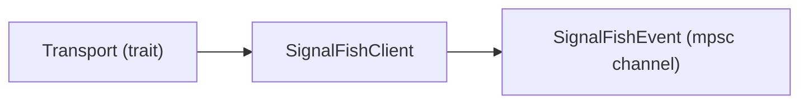
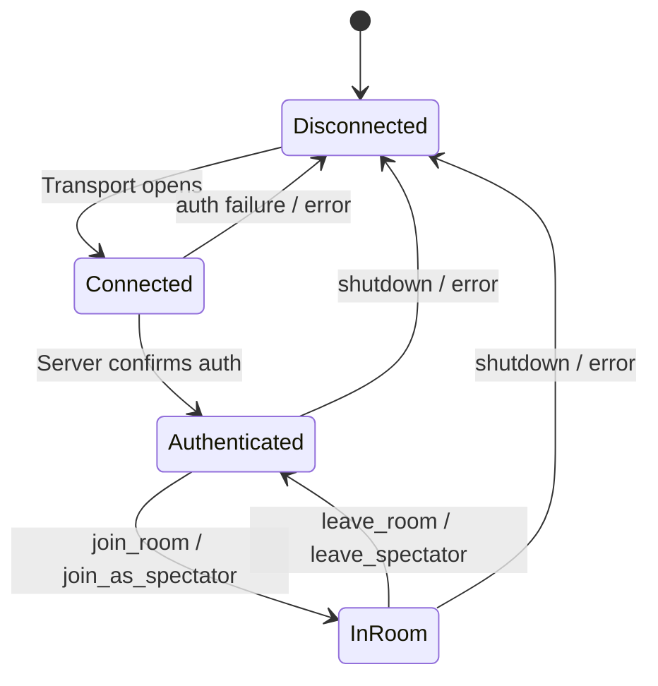
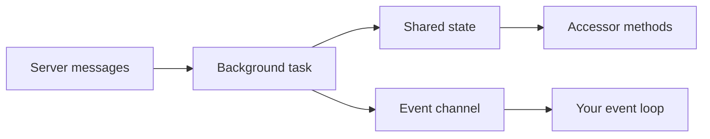

# Core Concepts

This page explains the foundational ideas behind the Signal Fish Client SDK.
Understanding these concepts will help you use the SDK effectively and debug
issues when they arise.

---

## Transport-Agnostic Design

The SDK separates **networking** from **client logic** through the `Transport`
trait. `SignalFishClient` never knows (or cares) whether it is talking over a
WebSocket, a raw TCP socket, a QUIC stream, or even an in-memory test loopback.


```mermaid
graph LR
    A["Transport (trait)"] --> B["SignalFishClient"]
    B --> C["SignalFishEvent (mpsc channel)"]
```

The `Transport` trait defines three async methods — send, receive, and close:

```rust,ignore
#[async_trait]
pub trait Transport: Send + 'static {
    async fn send(&mut self, message: String) -> Result<(), SignalFishError>;
    async fn recv(&mut self) -> Option<Result<String, SignalFishError>>;
    async fn close(&mut self) -> Result<(), SignalFishError>;
}
```

| Method | Purpose |
|--------|---------|
| `send` | Transmit one serialized JSON message to the server. |
| `recv` | Receive the next JSON message. Returns `None` on clean close. **Must be cancel-safe.** |
| `close` | Gracefully shut down the underlying connection. |

!!! tip "Bring your own transport"
    Connection setup is intentionally **not** part of the trait. Different
    transports have different connection parameters (URLs, host:port, QUIC
    endpoints, etc.). Construct a connected transport externally, then hand it
    to `SignalFishClient::start`.

The crate ships with a ready-made `WebSocketTransport` (behind the `transport-websocket`
feature flag), but you can implement the trait for any medium.

---

## Client Lifecycle

`SignalFishClient` follows a linear state machine. Every session progresses
through the same states:


```mermaid
stateDiagram-v2
    [*] --> Disconnected
    Disconnected --> Connected : Transport opens
    Connected --> Authenticated : Server confirms auth
    Authenticated --> InRoom : join_room / join_as_spectator
    InRoom --> Authenticated : leave_room / leave_spectator
    Authenticated --> Disconnected : shutdown / error
    InRoom --> Disconnected : shutdown / error
    Connected --> Disconnected : auth failure / error
```

| Transition | Trigger |
|------------|---------|
| **Disconnected → Connected** | `SignalFishClient::start` spawns the background task and emits `SignalFishEvent::Connected`. |
| **Connected → Authenticated** | The SDK auto-sends an `Authenticate` message. On success the server replies and `SignalFishEvent::Authenticated` is emitted. |
| **Authenticated → InRoom** | Call `client.join_room(params)` or `client.join_as_spectator(...)`. The server responds with `SignalFishEvent::RoomJoined` (or `SpectatorJoined`). |
| **InRoom → Authenticated** | Call `client.leave_room()` or `client.leave_spectator()`. The server confirms with `SignalFishEvent::RoomLeft`. |
| **Any → Disconnected** | Call `client.shutdown().await`, drop the client, or encounter an unrecoverable transport error. `SignalFishEvent::Disconnected` is the final event (best-effort; see [Events](events.md) for delivery caveats). |

!!! warning "Authentication is automatic"
    You do **not** need to call an authenticate method. `SignalFishClient::start`
    sends the authentication message immediately using the `SignalFishConfig`
    you provide.

---

## Protocol versioning & topology

The SDK speaks two generations of the Signal Fish protocol, and you pick which
one through `SignalFishConfig`. For the full story see
[Protocol Versioning](protocol-versioning.md) and the [Mesh Guide](mesh-guide.md).

### The relay-floor guarantee

**v2 is the relay floor.** `SignalFishConfig::new("app")` advertises no v3
capabilities; the server relays all traffic through itself, and the
`Authenticate` message is **byte-identical** to the old v2 client. The promise:
opt into nothing and nothing changes.

**v3 is additive and opt-in.** `SignalFishConfig::enable_mesh()` advertises the
WebRTC/relay transports and mesh/host/relay topologies, letting the server form
a peer-to-peer session. Existing v2 code keeps working unchanged — v3 only adds
new optional fields, messages, and events that a v2 connection never sees.

### Capability negotiation

1. The client advertises what it can fulfill in `Authenticate`
   (`protocol_version`, `supported_transports`, `supported_topologies`).
2. The server clamps to its own range and echoes the negotiated
   `protocol_version` (plus min/max) back in `ProtocolInfo`.
3. The client records it; read it via `negotiated_protocol_version()` and
   `supports_mesh()` (true once the negotiated version is ≥ 3).

v3-only sends (`send_signal`, `report_transport_status`, …) **fail fast** with
[`SignalFishError::ProtocolUnsupported`](errors.md) until v3 is negotiated —
better than an asynchronous, unattributed server rejection. `start_game()` is the
one universal v2 change and is **not** guarded.

### Topology and transport

When the server forms a non-relay session it sends a `SessionPlan` naming the
chosen **topology** and data-path **transport**:

| `Topology` | Meaning |
|------------|---------|
| `Relay` | Server relays all traffic — the v2 behavior, always available. |
| `Host` | Star topology: one elected host relays for the session. |
| `Mesh` | Full mesh: every peer connects to every other peer. |

| `TransportKind` | Meaning |
|-----------------|---------|
| `Relay` | Via the signaling server (the mandatory floor; `fallback` is always this). |
| `Direct` | A direct IP:port connection. |
| `WebRtc` | A peer-to-peer WebRTC data channel (serializes as `"webrtc"`). |

### Client obeys the server

The server is the brain. It selects topology/transport and assigns the
deterministic WebRTC offerer via the `initiate` flag (in `SessionPlan.peers`) and
`you_initiate` (in `NewPeer`). **The client copies these verbatim and never
computes who offers** — this is what avoids WebRTC "glare" (two peers offering at
once). See the [Mesh Guide](mesh-guide.md).

---

## Event-Driven Architecture

All server responses arrive as `SignalFishEvent` variants on a **bounded
`mpsc::Receiver<SignalFishEvent>`** (default capacity 256, configurable via
`SignalFishConfig::event_channel_capacity`). Your application consumes
them in an async loop:

```rust,ignore
let config = SignalFishConfig::new("mb_app_abc123");
let (client, mut events) = SignalFishClient::start(transport, config);

while let Some(event) = events.recv().await {
    match event {
        SignalFishEvent::Connected => {
            println!("Transport connected, awaiting auth…");
        }
        SignalFishEvent::Authenticated { app_name, .. } => {
            println!("Authenticated as {app_name}");
        }
        SignalFishEvent::RoomJoined { room_code, current_players, .. } => {
            println!("Joined room {room_code} with {} players", current_players.len());
        }
        SignalFishEvent::Disconnected { reason } => {
            println!("Disconnected: {reason:?}");
            break;
        }
        _ => {}
    }
}
```

### Synthetic vs. Server Events

Most events correspond 1:1 to a server message. Two **synthetic** events are
generated locally by the transport layer:

| Event | Origin |
|-------|--------|
| `SignalFishEvent::Connected` | Emitted when the transport opens, before any server message. |
| `SignalFishEvent::Disconnected { reason }` | Emitted when the transport closes or errors. Last event (best-effort). |

!!! note "Lossless delivery with backpressure"
    Events are **never dropped**. The event channel has a default capacity of
    **256** (configurable via `SignalFishConfig::event_channel_capacity`); if
    your consumer falls behind, the transport loop pauses reading from the
    transport until the channel has room, so backpressure propagates to the
    server instead of losing events. The capacity only controls how much
    buffering the consumer gets before that backpressure kicks in. An event
    can only be missed if the receiver is dropped, a shutdown timeout aborts
    the transport task, or the client handle is dropped without calling
    `shutdown()` (see [Events](events.md)). A responsive event
    loop keeps the connection flowing; a stalled one stalls the transport.

---

## Non-Blocking Command Sending

All client command methods — `join_room`, `leave_room`, `send_game_data`,
`set_ready`, `request_authority`, `provide_connection_info`, `reconnect`,
`join_as_spectator`, `leave_spectator`, `ping` — are **synchronous**. They
serialize a `ClientMessage`, queue it on an internal **bounded** channel
(default capacity **1024**, configurable via
`SignalFishConfig::command_channel_capacity`), and return `Result<()>`
immediately. There is no `.await`.

```rust,ignore
// These return instantly — no network round-trip
client.join_room(
    JoinRoomParams::new("my-game", "Alice")
        .with_max_players(4),
)?;

client.send_game_data(serde_json::json!({ "action": "move", "x": 10 }))?;

client.set_ready()?;
```

When the queue is full — the caller is producing faster than the transport
can drain — these methods **fail fast** with
[`SignalFishError::SendBufferFull`](errors.md): the message is *not* queued,
and nothing is silently dropped. For high-rate payloads, use the
backpressure-aware async variants instead, which wait for a free slot rather
than failing:

```rust,ignore
// Waits for queue capacity — paces the caller to actual transport throughput.
client.send_game_data_reliable(serde_json::json!({ "input": frame_input })).await?;

// Same for WebRTC signals (protocol v3 only) — a lost signal stalls a handshake.
client.send_signal_reliable(peer_id, PeerSignal::Offer(sdp)).await?;
```

`send_capacity()` (remaining slots) and `max_send_capacity()` (configured
capacity) expose the queue state for pacing and diagnostics.

Besides the state accessors and the `*_reliable` sends, the only other async
method on the client is `shutdown()`:

```rust,ignore
client.shutdown().await;
```

### Reliability and Flow Control

Putting the two halves together, the client **never silently drops data** in
either direction:

- **Inbound:** events are delivered with backpressure — a lagging consumer
  pauses the transport loop; nothing is lost. Frames that fail to decode
  (an unknown message type or error code from a newer server, malformed
  JSON) surface as [`DecodeFailed`](events.md#decodefailed) events instead
  of being skipped.
- **Outbound:** queue admission is never silent — congestion surfaces as
  `SendBufferFull` (fail-fast methods) or as waiting (`*_reliable` methods),
  never as an unbounded backlog. Note that *queued* is not *delivered*:
  commands still in the queue when the connection ends are discarded with
  it, surfaced by the `Disconnected` event.

The server's half of the story — the relay's reliable-and-ordered
guarantee, backpressure toward senders, slow-consumer eviction, and the
measured capacity envelope — is documented in
[Delivery Contract & Backpressure](delivery.md).

Because the client is lossless, loss elsewhere becomes observable. `stats()`
returns [`ClientStats`](client.md) with cumulative `game_data_sent` /
`game_data_received` / `messages_undecodable` counters (they survive
disconnects): exchange or log them across peers, and a persistent
sent-vs-received deficit points at the relay path or a peer — not at this
client. Pace high-rate streams with
`send_game_data_reliable` instead of guessing at sleep durations — but drain
events from a separate task while awaiting it: the queue only drains while
the transport loop runs, and the loop pauses when the event channel is full,
so a lone task doing both strictly sequentially can deadlock under
simultaneous send + receive pressure.

---

### State Accessors

| Accessor | Async? | Returns |
|----------|--------|---------|
| `is_connected()` | No | `bool` |
| `is_authenticated()` | No | `bool` |
| `current_player_id()` | Yes (`async`) | `Option<PlayerId>` |
| `current_room_id()` | Yes (`async`) | `Option<RoomId>` |
| `current_room_code()` | Yes (`async`) | `Option<String>` |

The synchronous accessors use `AtomicBool` internally. The async accessors use
a `tokio::sync::Mutex` because they guard heap-allocated optional state.

## Driving the Client (Runtime Contract)

`SignalFishClient::start` spawns the background transport loop with
`tokio::spawn`. That loop only makes progress while the tokio runtime is
**driven** — some task is being awaited (`#[tokio::main]`, `block_on`, worker
threads). Both multi-thread and `current_thread` runtimes work, as long as
the runtime is actually running.

What does **not** work is "ticking" a runtime manually — e.g. calling one
`yield_now().await` per game frame: the transport loop starves and messages
appear to vanish. For frame-driven or single-threaded environments (game
engines, `wasm32` targets), use `SignalFishPollingClient` (feature
`polling-client`) instead: a synchronous pump you call once per frame, with
no background task and no runtime at all. See the
[WebAssembly Guide](wasm.md) and [Client API](client.md#signalfishpollingclient).

---

## State Management

The SDK maintains internal state that is updated by the background transport
loop as server messages arrive:

| Field | Type | Updated when |
|-------|------|-------------|
| `connected` | `AtomicBool` | Transport opens / closes |
| `authenticated` | `AtomicBool` | `Authenticated` event received |
| `player_id` | `Mutex<Option<PlayerId>>` | `RoomJoined` / `Reconnected` / `SpectatorJoined` |
| `room_id` | `Mutex<Option<RoomId>>` | `RoomJoined` / `RoomLeft` / `Reconnected` / `SpectatorJoined` / `SpectatorLeft` |
| `room_code` | `Mutex<Option<String>>` | `RoomJoined` / `RoomLeft` / `Reconnected` / `SpectatorJoined` / `SpectatorLeft` |

State flows **one direction**: the background task writes, your code reads
through the accessors. You never set state directly.


```mermaid
graph LR
    S["Server messages"] --> T["Background task"]
    T --> St["Shared state"]
    T --> E["Event channel"]
    St --> A["Accessor methods"]
    E --> U["Your event loop"]
```

!!! note
    State updates happen *before* the corresponding event is emitted on the
    channel. By the time you receive `SignalFishEvent::RoomJoined`,
    `client.current_room_id().await` already returns `Some(...)`.

---

## Graceful Shutdown

To stop the client cleanly, call `shutdown()`:

```rust,ignore
client.shutdown().await;
```

Under the hood this:

1. Sends a signal to the background transport loop via a `oneshot` channel.
2. The loop calls `transport.close()` and emits `SignalFishEvent::Disconnected`.
3. `shutdown()` awaits the background task with a configurable timeout (default
   **1 second**, set via `SignalFishConfig::shutdown_timeout`). If the task does
   not finish in time, it is aborted to prevent detached background work.
4. On completion, client session state is reset even if the `Disconnected`
   event was not delivered due to timeout/abort.

### Drop Fallback

If `shutdown()` is never called and the `SignalFishClient` is dropped, the
`Drop` implementation **aborts** the background task immediately. This is a
last-resort cleanup — always prefer an explicit `shutdown().await` so that the
server receives a clean close and `Disconnected` is emitted.

!!! warning
    `Drop` cannot run async code. It calls `task.abort()`, which cancels the
    future without executing `transport.close()`. The server may see an
    unclean disconnection.

---

## Error Handling Model

Errors are split into two layers depending on where they originate.

### Client-Side: `SignalFishError`

`SignalFishError` covers transport and local failures. These are returned
directly from client methods as `Result<(), SignalFishError>`.

| Variant | Meaning |
|---------|---------|
| `TransportSend(String)` | Failed to write to the transport. |
| `TransportReceive(String)` | Failed to read from the transport. |
| `TransportClosed` | The transport connection closed unexpectedly. |
| `Serialization(serde_json::Error)` | JSON serialization / deserialization failed. |
| `NotConnected` | Attempted an operation without an active connection. |
| `SendBufferFull { capacity }` | The bounded outgoing command queue is full; the message was refused, not queued. See [Non-Blocking Command Sending](#non-blocking-command-sending). |
| `NotInRoom` | Attempted a room operation without being in a room. |
| `ServerError { message, error_code }` | The server returned an error; `error_code` is `Option<ErrorCode>` and may be absent. |
| `ProtocolUnsupported { mode }` | A protocol-v3-only send was attempted before v3 was negotiated. See [Protocol versioning & topology](#protocol-versioning--topology). |
| `Timeout` | An operation exceeded its time limit. |
| `Io(std::io::Error)` | An underlying I/O error occurred. |

### Server-Side: `ErrorCode`

`ErrorCode` is a 50-variant enum that arrives inside events. The server sends
these as `SCREAMING_SNAKE_CASE` strings (e.g., `"ROOM_NOT_FOUND"`).

```rust,ignore
match event {
    SignalFishEvent::Error { message, error_code } => {
        println!("Server error: {message} ({error_code:?})");
    }
    SignalFishEvent::AuthenticationError { error, error_code } => {
        println!("Auth failed: {error} ({})", error_code.description());
    }
    _ => {}
}
```

Error codes are grouped by category:

| Category | Examples |
|----------|---------|
| **Authentication** | `Unauthorized`, `InvalidAppId`, `AppIdExpired`, `SdkVersionUnsupported` |
| **Validation** | `InvalidInput`, `InvalidGameName`, `InvalidPlayerName`, `MessageTooLarge` |
| **Room** | `RoomNotFound`, `RoomFull`, `AlreadyInRoom`, `NotInRoom` |
| **Authority** | `AuthorityNotSupported`, `AuthorityConflict`, `AuthorityDenied` |
| **Rate Limiting** | `RateLimitExceeded`, `TooManyConnections` |
| **Reconnection** | `ReconnectionFailed`, `ReconnectionTokenInvalid`, `ReconnectionExpired` |
| **Spectator** | `SpectatorNotAllowed`, `TooManySpectators`, `SpectatorJoinFailed` |
| **Server** | `InternalError`, `StorageError`, `ServiceUnavailable` |
| **Game Start (v2)** | `GameStartNotReady`, `GameStartForbidden` |
| **Signaling (v3)** | `CrossRoomSignal`, `UnsupportedTransport`, `SignalTargetNotFound`, `SignalRateLimited`, `SignalTooLarge` |
| **Connection Lifecycle (v3)** | `ConnectionIdleTimeout` |

See [Errors](errors.md) for the full table with descriptions.

!!! tip "Programmatic handling"
    Every `ErrorCode` variant has a `.description()` method that returns a
    human-readable explanation. Use the enum variant for `match`-based control
    flow and the description for user-facing messages.
