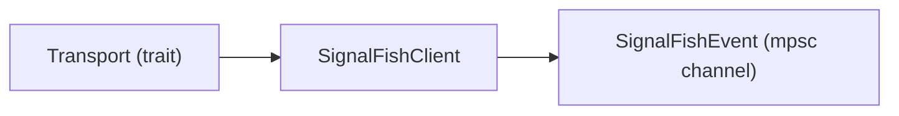
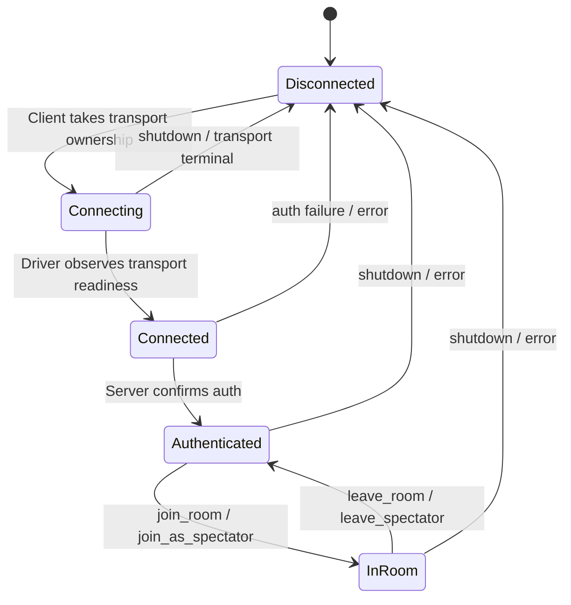
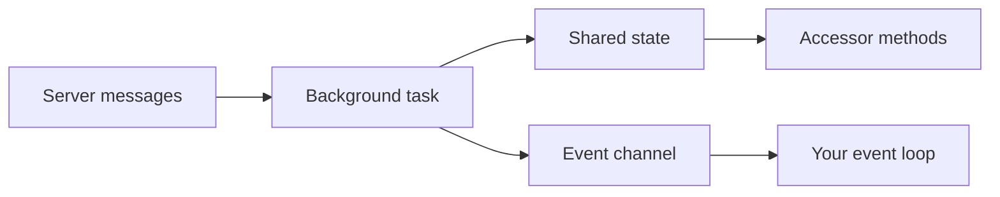

# Core Concepts

This page explains the foundational ideas behind the Signal Fish Client SDK.
Understanding these concepts will help you use the SDK effectively and debug
issues when they arise.

---

## Transport-Agnostic Design

The SDK separates **networking** from **client logic** through the `Transport`
trait. `SignalFishClient` never knows (or cares) whether it is talking over a
WebSocket, a raw TCP socket, a QUIC stream, or even an in-memory test loopback.


```mermaid
graph LR
    A["Transport (trait)"] --> B["SignalFishClient"]
    B --> C["SignalFishEvent (mpsc channel)"]
```

The object-safe `Transport` trait defines three polling methods over text or
binary frames:

```rust,ignore
pub trait Transport {
    fn begin_poll_cycle(&mut self) {}
    fn poll_send(&mut self, cx: &mut Context<'_>, frame: &mut Option<TransportFrame>)
        -> Poll<Result<(), SignalFishError>>;
    fn poll_recv(&mut self, cx: &mut Context<'_>)
        -> Poll<Option<Result<TransportFrame, SignalFishError>>>;
    fn poll_close(&mut self, cx: &mut Context<'_>)
        -> Poll<Result<(), SignalFishError>>;
    fn abort(&mut self);
    fn is_ready(&self) -> bool { true }
    fn close_info(&self) -> Option<TransportCloseInfo> { None }
    fn diagnostics(&self) -> TransportDiagnostics { TransportDiagnostics::default() }
}
```

| Method | Purpose |
|--------|---------|
| `poll_send` | Accept and progress one `TransportFrame`; preserve ownership correctly across `Pending`. |
| `poll_recv` | Poll the next text/binary frame; `Ready(None)` is a clean close. |
| `poll_close` | Progress idempotent graceful shutdown across calls. |
| `abort` | Immediately abandon backend work and end driver polling after a deadline, close error, or owner drop. |

The required `abort` method enforces deadline abandonment. It releases or
safely detaches backend resources, discards accepted sends, and makes later
polling invalid; only repeated `abort`, `is_ready`, `close_info`, `diagnostics`,
and drop remain allowed. The
remaining defaulted hooks mark a polling cycle, report handshake readiness and
close metadata, and expose backend-owned diagnostics.

The trait has no `Send` bound, allowing engine-owned main-thread transports.
The async client adds `Send + 'static` at `start`; the polling client does not.

!!! tip "Bring your own transport"
    Connection setup is intentionally **not** part of the trait. Different
    transports have different connection parameters (URLs, host:port, QUIC
    endpoints, etc.). Construct a transport externally, then hand it to
    `SignalFishClient::start`; an asynchronous handshake may still be in
    progress if its `is_ready()` returns `false`.

The crate ships with a ready-made `WebSocketTransport` (behind the `transport-websocket`
feature flag), but you can implement the trait for any medium.

---

## Client Lifecycle

`SignalFishClient` follows a linear state machine. Every session progresses
through the same states:


```mermaid
stateDiagram-v2
    [*] --> Disconnected
    Disconnected --> Connecting : Client takes transport ownership
    Connecting --> Connected : Driver observes transport readiness
    Connected --> Authenticated : Server confirms auth
    Authenticated --> InRoom : join_room / join_as_spectator
    InRoom --> Authenticated : leave_room / leave_spectator
    Authenticated --> Disconnected : shutdown / error
    InRoom --> Disconnected : shutdown / error
    Connected --> Disconnected : auth failure / error
    Connecting --> Disconnected : shutdown / transport terminal
```

| Transition | Trigger |
|------------|---------|
| **Disconnected → Connecting** | Constructing either client transfers ownership of a nonterminal transport attempt; `is_connected()` is true while `is_transport_ready()` remains false. |
| **Connecting → Connected** | Both drivers emit `Connected` on their first observation that `Transport::is_ready()` is true. For the polling client, observation occurs only while the application calls `poll()`. |
| **Connected → Authenticated** | The SDK auto-sends an `Authenticate` message. On success the server replies and `SignalFishEvent::Authenticated` is emitted. |
| **Authenticated → InRoom** | Call `client.join_room(params)` or `client.join_as_spectator(...)`. The server responds with `SignalFishEvent::RoomJoined` (or `SpectatorJoined`). |
| **InRoom → Authenticated** | Call `client.leave_room()` or `client.leave_spectator()`. The server confirms with `SignalFishEvent::RoomLeft`. |
| **Any → Disconnected** | Call `client.shutdown().await`, drop the client, or encounter an unrecoverable transport error. `SignalFishEvent::Disconnected` is the final event (best-effort; see [Events](events.md) for delivery caveats). |

!!! warning "Authentication is automatic"
    You do **not** need to call an authenticate method. `SignalFishClient::start`
    queues the authentication message immediately using the `SignalFishConfig`
    you provide. The driver transfers it once the transport is ready.

---

## Protocol versioning and topology

The SDK speaks two generations of the Signal Fish protocol, and you pick which
one through `SignalFishConfig`. For the full story see
[Protocol Versioning](protocol-versioning.md) and the [Mesh Guide](mesh-guide.md).

### The relay-floor guarantee

**v2 is the relay floor.** `SignalFishConfig::new("app")` advertises no v3
capabilities; the server relays all traffic through itself, and the
`Authenticate` message is **byte-identical** to the old v2 client. This
guarantee concerns negotiation and relay behavior. Version 0.8 also made game
start explicit: after readiness, an eligible client must call `start_game()`.

**v3 is additive and opt-in.** `SignalFishConfig::enable_v3()` advertises
relay/accountability v3 without WebRTC. `enable_mesh()` additionally advertises
the WebRTC/relay transports and mesh/host/relay topologies, letting the server
form a peer-to-peer session. v3 only adds optional fields, messages, and events
that a v2 connection never sees.

### Capability negotiation

1. The client advertises what it can fulfill in `Authenticate`
   (`protocol_version`, `supported_transports`, `supported_topologies`).
2. The server clamps to its own range and echoes the negotiated
   `protocol_version` (plus min/max) back in `ProtocolInfo`.
3. The client records it; `supports_mesh()` reports negotiated local capability
   only when WebRTC and a Host or Mesh topology were advertised. It does not say
   which plan the server selected.

v3-only sends (`send_signal`, `report_transport_status`, …) **fail fast** with
[`SignalFishError::ProtocolUnsupported`](errors.md) until v3 is negotiated —
better than an asynchronous, unattributed server rejection. `start_game()` is the
one universal v2 change and is **not** guarded.

### Topology and transport

When the server finalizes a v3 session it sends a `SessionPlan` naming the
chosen **topology** and data-path **transport**. This includes an explicit
relay/relay plan that resets any prior peer-to-peer state:

| `Topology` | Meaning |
|------------|---------|
| `Relay` | Server relays all traffic — the v2 behavior, always available. |
| `Host` | Star topology: one elected host relays for the session. |
| `Mesh` | Full mesh: every peer connects to every other peer. |

| `TransportKind` | Meaning |
|-----------------|---------|
| `Relay` | Via the signaling server (the mandatory floor; `fallback` is always this). |
| `Direct` | A direct IP:port connection. |
| `WebRtc` | A peer-to-peer WebRTC data channel (serializes as `"webrtc"`). |

### Client obeys the server

The server is the brain. It selects topology/transport and assigns the
deterministic WebRTC offerer via the `initiate` flag (in `SessionPlan.peers`) and
`you_initiate` (in `NewPeer`). **The client copies these verbatim and never
computes who offers** — this is what avoids WebRTC "glare" (two peers offering at
once). See the [Mesh Guide](mesh-guide.md).

---

## Typed Event Architecture

Both drivers convert server responses into `SignalFishEvent` variants. The
async `SignalFishClient` delivers them on a **bounded
`mpsc::Receiver<SignalFishEvent>`** (default capacity 256, configurable via
`SignalFishConfig::event_channel_capacity`), which an application consumes in
an async loop:

```rust,ignore
let config = SignalFishConfig::new("mb_app_abc123");
let (client, mut events) = SignalFishClient::start(transport, config);

while let Some(event) = events.recv().await {
    match event {
        SignalFishEvent::Connected => {
            println!("Transport connected, awaiting auth…");
        }
        SignalFishEvent::Authenticated { app_name, .. } => {
            println!("Authenticated as {app_name}");
        }
        SignalFishEvent::RoomJoined { room_code, current_players, .. } => {
            println!("Joined room {room_code} with {} players", current_players.len());
        }
        SignalFishEvent::Disconnected { reason, .. } => {
            println!("Disconnected: {reason:?}");
            break;
        }
        _ => {}
    }
}
```

`SignalFishPollingClient::poll()` returns the events decoded during that
bounded polling cycle directly as a `Vec<SignalFishEvent>`; it does not create
an event channel.

### Synthetic vs. Server Events

Most events correspond 1:1 to a server message. Three **synthetic** events
are generated locally by the transport layer:

| Event | Origin |
|-------|--------|
| `SignalFishEvent::Connected` | Emitted when the transport opens, before any server message. |
| `SignalFishEvent::Disconnected { reason, .. }` | Emitted when the transport closes or errors. Last event (best-effort). |
| `SignalFishEvent::DecodeFailed { .. }` | Emitted when an inbound frame fails to decode; the connection stays open. See [Events](events.md#decodefailed). |

!!! note "Lossless delivery with backpressure"
    Events are **never dropped on overflow**. The event channel has a default capacity of
    **256** (configurable via `SignalFishConfig::event_channel_capacity`); if
    your consumer falls behind, the transport loop pauses reading from the
    transport until the channel has room, so backpressure propagates to the
    server instead of losing events. The capacity only controls how much
    buffering the consumer gets before that backpressure kicks in. An event
    can only be missed if the receiver is dropped, if the client handle is
    dropped without calling `shutdown()`, or on `shutdown()` — which delivers
    the terminal `Disconnected` best-effort and may drop it if the channel is
    full (see [Events](events.md); the channel closing is the guaranteed
    end-of-stream signal). A responsive event loop keeps the connection
    flowing; a stalled one stalls the transport.

---

## Non-Blocking Command Sending

All common command methods — including room operations, game-data sends,
`set_ready`, `start_game`, authority/reconnection/spectator operations, ping,
and protocol-v3 signaling — are **synchronous**. They
serialize a `ClientMessage`, queue it on an internal **bounded** channel
(default capacity **1024**, configurable via
`SignalFishConfig::command_channel_capacity`), and return `Result<()>`
immediately. There is no `.await`.

```rust,ignore
// These return instantly — no network round-trip
client.join_room(
    JoinRoomParams::new("my-game", "Alice")
        .with_max_players(4),
)?;

client.send_game_data(serde_json::json!({ "action": "move", "x": 10 }))?;

client.set_ready()?;
// Later, after LobbyStateChanged reports all_ready=true:
client.start_game()?;
```

When the queue is full — the caller is producing faster than the transport
can drain — these methods **fail fast** with
[`SignalFishError::SendBufferFull`](errors.md): the message is *not* queued,
and nothing is silently dropped. For high-rate payloads, use the
backpressure-aware async variants instead, which wait for a free slot rather
than failing:

```rust,ignore
// Waits for queue capacity — paces the caller to actual transport throughput.
client.send_game_data_reliable(serde_json::json!({ "input": frame_input })).await?;

// Same for WebRTC signals (protocol v3 only) — a lost signal stalls a handshake.
client.send_signal_reliable(peer_id, PeerSignal::Offer(sdp)).await?;
```

`send_capacity()` (remaining slots) and `max_send_capacity()` (configured
capacity) expose the queue state for pacing and diagnostics.

Besides the state accessors and the `*_reliable` sends, the only other async
method on the client is `shutdown()`:

```rust,ignore
client.shutdown().await;
```

### Reliability and Flow Control

Putting the two halves together, the client does not silently drop data because
of bounded-channel overflow during normal operation:

- **Inbound:** events are delivered with backpressure — a lagging consumer
  pauses the transport loop rather than causing overflow loss. Frames that fail to decode
  (an unknown message type or error code from a newer server, malformed
  JSON) surface as [`DecodeFailed`](events.md#decodefailed) events instead
  of being skipped.
- **Outbound:** queue admission is never silent — congestion surfaces as
  `SendBufferFull` (fail-fast methods) or as waiting (`*_reliable` methods),
  never as an unbounded backlog. Note that *queued* is not *delivered*:
  commands still in the queue when the connection ends are discarded with
  it. `Disconnected` itself is best-effort during shutdown.

Receiver drop, dropping the handle without shutdown, shutdown preempting one
blocked delivery, transport failure, and protocol quarantine remain explicit
delivery boundaries; see [Events](events.md#connection-events).

The server's half of the story — the relay's reliable-and-ordered
guarantee, backpressure toward senders, slow-consumer eviction, and the
measured capacity envelope — is documented in
[Delivery Contract & Backpressure](delivery.md).

Because the client applies backpressure instead of dropping events on
overflow, boundary-specific loss becomes diagnosable. `stats()` returns
[`ClientStats`](client.md) with cumulative `game_data_sent` /
`game_data_received` / `messages_undecodable` counters (they survive
disconnects). Sent counts transport ownership transfers, including an accepted
send that later fails; received counts successfully decoded relay game data,
including stale or quarantined messages suppressed before application. Fanout,
delivery-class policy, server rejection, terminal unread work, and WebRTC
data-channel traffic mean peer counters are diagnostic rather than an equality.
Pace
high-rate streams with
`send_game_data_reliable` instead of guessing at sleep durations — but drain
events from a separate task while awaiting it: the queue only drains while
the transport loop runs, and the loop pauses when the event channel is full,
so a lone task doing both strictly sequentially can deadlock under
simultaneous send + receive pressure.

---

### State Accessors

| Accessor | Async? | Returns |
|----------|--------|---------|
| `is_connected()` | No | `bool` |
| `is_transport_ready()` | No | `bool` |
| `is_authenticated()` | No | `bool` |
| `snapshot()` | No | `ClientSnapshot` |
| `room_role()` | No | `Option<RoomRole>` |
| `negotiated_protocol_version()` | No | `Option<u16>` |
| `supports_mesh()` | No | `bool` (negotiated WebRTC + Host/Mesh capability) |
| `session_topology()` | No | `Option<Topology>` |
| `session_transport()` | No | `Option<TransportKind>` |
| `is_p2p_active()` | No | `bool` (selected plan is Host or Mesh) |
| `current_player_id()` | Yes (`async`) | `Option<PlayerId>` |
| `current_room_id()` | Yes (`async`) | `Option<RoomId>` |
| `current_room_code()` | Yes (`async`) | `Option<String>` |

Use `snapshot()` when multiple values must describe one instant, especially the
selected `session_topology`/`session_transport` pair. The individual
async room/player accessors are convenient for one-off reads but are not one
coherent multi-field observation.

## Driving the Client (Runtime Contract)

`SignalFishClient::start` spawns the background transport loop with
`tokio::spawn`. That loop only makes progress while the tokio runtime is
**driven** — some task is being awaited (`#[tokio::main]`, `block_on`, worker
threads). Both multi-thread and `current_thread` runtimes work, as long as
the runtime is actually running.

What does **not** work is "ticking" a runtime manually — e.g. calling one
`yield_now().await` per game frame: the transport loop starves and messages
appear to vanish. For frame-driven or single-threaded environments (game
engines, `wasm32` targets), use `SignalFishPollingClient` (feature
`polling-client`) instead: a synchronous pump you call once per frame, with
no background task and no runtime at all. See the
[WebAssembly Guide](wasm.md) and [Client API](client.md#signalfishpollingclient).

---

## State Management

The SDK maintains internal state that is updated by the background transport
loop as server messages arrive:

| Field | Type | Updated when |
|-------|------|-------------|
| `connected` | `bool` | Transport opens / closes |
| `authenticated` | `bool` | `Authenticated` event received |
| `room_role` | `Option<RoomRole>` | Confirmed player/spectator join, reconnect, or exit |
| `player_id` | `Option<PlayerId>` | Confirmed player/spectator join or reconnect; cleared on every exit |
| `room_id` | `Option<RoomId>` | `RoomJoined` / `RoomLeft` / `Reconnected` / spectator lifecycle |
| `room_code` | `Option<String>` | `RoomJoined` / `RoomLeft` / `Reconnected` / spectator lifecycle |
| `reconnection_token` | `Option<String>` | `RoomJoined` / `Reconnected` / room exit |
| `negotiated_protocol_version` | `Option<u16>` | `ProtocolInfo` / disconnect |
| `quarantined` | `bool` | Protocol-v3 accountability policy / authoritative room baseline or exit |

State flows **one direction**: the background task writes, your code reads
through the accessors. You never set state directly.

`room_role`, `player_id`, `room_id`, and `room_code` are one coherent
membership invariant. They are all absent outside a room and all present for a
confirmed player or spectator. `current_player_id()` is a legacy name for the
participant ID. When interpreting the role and ID together, match both from one
`snapshot()`; separate accessor calls can straddle a background transition.

Client commands are checked against this state before queue capacity: join and
reconnect commands require no membership; gameplay, player-leave, readiness,
authority, connection-info, signaling, and transport-status commands require
`RoomRole::Player`; `leave_spectator` requires `RoomRole::Spectator`; and
`ping` is role-independent. Once a room transition is admitted, later room
commands return `RoomOperationPending` until a matching typed terminal
response, so FIFO work cannot silently cross a pending leave or join. Generic
server errors and absent responses remain fail-closed until transport teardown;
start a new connection to retry after teardown.


```mermaid
graph LR
    S["Server messages"] --> T["Background task"]
    T --> St["Shared state"]
    T --> E["Event channel"]
    St --> A["Accessor methods"]
    E --> U["Your event loop"]
```

!!! note
    State updates happen *before* the corresponding event is emitted on the
    channel. By the time you receive `SignalFishEvent::RoomJoined`,
    `client.current_room_id().await` already returns `Some(...)`.

---

## Graceful Shutdown

To stop the client cleanly, call `shutdown()`:

```rust,ignore
client.shutdown().await;
```

Under the hood this:

1. Sends a signal to the background transport loop via a `oneshot` channel.
2. The loop attempts `SignalFishEvent::Disconnected`, finishes any
   backend-owned send, and drives `Transport::poll_close` within the configured
   close deadline (default **1 second**).
3. Deadline expiry invokes `Transport::abort`, after which the loop normally
   returns. `shutdown()` uses a later deadline-plus-grace watchdog to cancel
   the task only if it still does not stop.
4. On completion, client session state is reset even if the `Disconnected`
   event was not delivered due to timeout/abort.

### Drop Fallback

If `shutdown()` is never called and the `SignalFishClient` is dropped, the
`Drop` implementation **aborts** the background task immediately. This is a
last-resort cleanup — prefer an explicit `shutdown().await` so that the server
can receive a clean close and `Disconnected` can be delivered when channel
capacity and the shutdown deadline permit.

!!! warning
    `Drop` cannot run async code. It calls `task.abort()`, which cancels the
    future without driving `Transport::poll_close`; the task's ownership guard
    then invokes the required `Transport::abort` fallback. The server may see
    an unclean disconnection.

---

## Error Handling Model

Errors are split into two layers depending on where they originate.

### Client-Side: `SignalFishError`

`SignalFishError` covers transport and local failures. These are returned
directly from client methods as `Result<(), SignalFishError>`.

| Variant | Meaning |
|---------|---------|
| `TransportSend(String)` | Failed to write to the transport. |
| `TransportReceive(String)` | Failed to read from the transport. |
| `TransportClosed` | The transport connection closed unexpectedly. |
| `Serialization(serde_json::Error)` | JSON serialization / deserialization failed. |
| `NotConnected` | Attempted an operation without an active connection. |
| `SendBufferFull { capacity }` | The bounded outgoing command queue is full; the message was refused, not queued. See [Non-Blocking Command Sending](#non-blocking-command-sending). |
| `NotInRoom` | Attempted a room operation without being in a room. |
| `AlreadyInRoom` | Attempted to join or reconnect while already a player or spectator. |
| `RoomOperationPending` | A prior admitted join, leave, or reconnect still awaits a matching typed terminal response. Generic errors and absent responses stay fenced until transport teardown. |
| `WrongRoomRole { required, actual }` | The operation requires player or spectator membership of a different kind. |
| `AuthorityRequired` | The current player is not authorized for an authority-only command. |
| `ServerError { message, error_code }` | The server returned an error; `error_code` is `Option<ErrorCode>` and may be absent. |
| `ProtocolUnsupported { mode }` | A protocol-v3-only send was attempted before v3 was negotiated. See [Protocol versioning and topology](#protocol-versioning-and-topology). |
| `BinaryFormatNotNegotiated` | Binary game data was requested while the connection uses JSON. |
| `Timeout` | An operation exceeded its time limit. |
| `Io(std::io::Error)` | An underlying I/O error occurred. |

### Server-Side: `ErrorCode`

`ErrorCode` is a 53-variant enum that arrives inside events. Server 0.7 emits
47 variants; six compatibility variants remain decodable for older servers.
The wire uses `SCREAMING_SNAKE_CASE` strings (e.g., `"ROOM_NOT_FOUND"`).

```rust,ignore
match event {
    SignalFishEvent::Error { message, error_code } => {
        println!("Server error: {message} ({error_code:?})");
    }
    SignalFishEvent::AuthenticationError { error, error_code } => {
        println!("Auth failed: {error} ({})", error_code.description());
    }
    _ => {}
}
```

Error codes are grouped by category:

| Category | Examples |
|----------|---------|
| **Authentication** | `Unauthorized`, `InvalidAppId`, `AppIdExpired`, `SdkVersionUnsupported` |
| **Validation** | `InvalidInput`, `InvalidGameName`, `InvalidPlayerName`, `MessageTooLarge` |
| **Room** | `RoomNotFound`, `RoomFull`, `AlreadyInRoom`, `NotInRoom` |
| **Authority** | `AuthorityNotSupported`, `AuthorityConflict`, `AuthorityDenied` |
| **Rate Limiting** | `RateLimitExceeded`, `TooManyConnections` |
| **Reconnection** | `ReconnectionFailed`, `ReconnectionTokenInvalid`, `ReconnectionExpired` |
| **Spectator** | `SpectatorNotAllowed`, `TooManySpectators`, `SpectatorJoinFailed` |
| **Server** | `InternalError`, `StorageError`, `ServiceUnavailable` |
| **Game Start (v2)** | `GameStartNotReady`, `GameStartForbidden` |
| **Signaling (v3)** | `CrossRoomSignal`, `UnsupportedTransport`, `SignalTargetNotFound`, `SignalRateLimited`, `SignalTooLarge` |
| **Connection Lifecycle (v3)** | `ConnectionIdleTimeout` |
| **Delivery & Liveness** | `SlowConsumer`, `ActivityTimeout`, `ServerDraining`, `InvalidDeliveryClass` |
| **Protocol Negotiation** | `UnsupportedProtocolVersion` |

See [Errors](errors.md) for the full table with descriptions.

!!! tip "Programmatic handling"
    Every `ErrorCode` variant has a `.description()` method that returns a
    human-readable explanation. Use the enum variant for `match`-based control
    flow and the description for user-facing messages.
