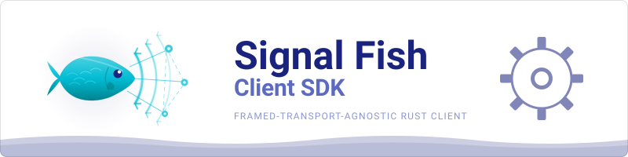

  

Rust + Godot multiplayer signaling

# Signal Fish Client SDK

Use this SDK to connect a Rust game to Signal Fish, place players in rooms,
relay game data, and react to server events. Choose an async Tokio client or a
polling client that runs inside your game loop.

[Install and connect](getting-started.md){ .md-button .md-button--primary .sf-home-action }
[View on GitHub](https://github.com/Ambiguous-Interactive/signal-fish-client-rust){ .md-button .sf-home-action }

!!! note "Release status"
    **0.12.0** is the current crates.io release and supports Rust **1.87.0** or
    newer. This site follows unreleased `main`; use the [0.12.0 API
    docs](https://docs.rs/signal-fish-client/0.12.0/) for the published surface.

## Get connected

1. Run or obtain a Signal Fish server and choose an App ID. It is a public
   application label, not a secret. The server's
   [five-minute quick start](https://ambiguous-interactive.github.io/signal-fish-server/quickstart/)
   provides a development setup.
2. Add `signal-fish-client` to your game.
3. Connect a transport and start a client.
4. Wait for `Authenticated`, then join a room.
5. Keep draining events while the client is active.

The [installation guide](getting-started.md) includes a complete first client.
The repository's [`basic_lobby` example](https://github.com/Ambiguous-Interactive/signal-fish-client-rust/blob/main/examples/basic_lobby.rs)
adds readiness, game start, reconnection state, error, and shutdown handling.

## Pick the right path

| If you are building | Start with |
| --- | --- |
| A Tokio-based Rust game or service | `SignalFishClient` and the built-in WebSocket transport |
| A Godot 4.5 native or web game | `SignalFishPollingClient` and the Godot adapter |
| A browser or frame-driven engine | `SignalFishPollingClient` and a platform transport |
| A game with WebRTC peers | Protocol v3 and the mesh guide after the relay path works |

Protocol v2 relay is the simplest starting point. Protocol v3 adds delivery
accountability and mesh signaling when your game needs them.

## Read by task

- :material-rocket-launch:{ .lg .middle } **Installation & Quick Start**

    ---

    Install the crate, connect, authenticate, and join a room.

    [:octicons-arrow-right-24: Installation & Quick Start](getting-started.md)

- :material-code-tags:{ .lg .middle } **Basic Lobby Walkthrough**

    ---

    Add readiness, game start, error handling, and graceful shutdown.

    [:octicons-arrow-right-24: Basic Lobby Walkthrough](examples.md)

- :material-gamepad-variant:{ .lg .middle } **Client API Reference**

    ---

    Find client configuration, room commands, game-data methods, and state.

    [:octicons-arrow-right-24: Client API Reference](client.md)

- :material-web:{ .lg .middle } **WebAssembly (WASM)**

    ---

    Integrate browser, Emscripten, or Godot native/web builds.

    [:octicons-arrow-right-24: WebAssembly (WASM)](wasm.md)

## When you need more detail

- [Events](events.md) and [errors](errors.md) describe what your event loop can
  receive.
- [Protocol versioning](protocol-versioning.md) helps you choose v2 relay or
  v3 delivery and mesh features.
- [Delivery and backpressure](delivery.md) explains queue sizing and congestion.
- [Transport](transport.md) is the contract for custom network backends.
- [docs.rs](https://docs.rs/signal-fish-client) is the exact Rust API reference.

The navigation groups these deeper topics separately so you can start without
reading the protocol internals first.
