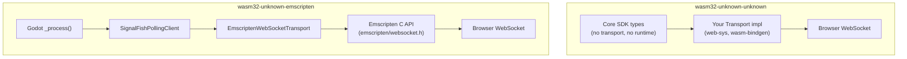
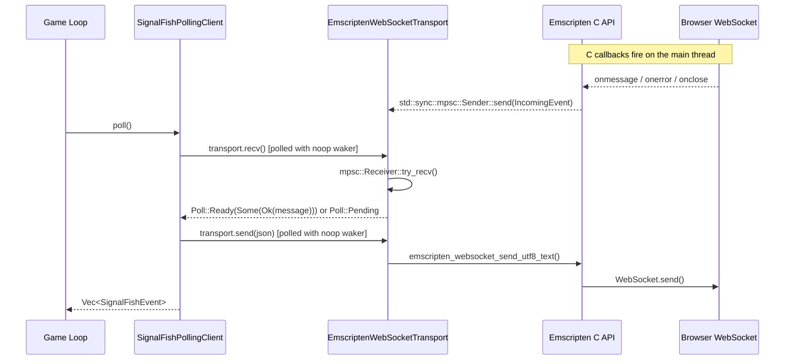
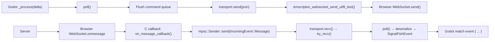
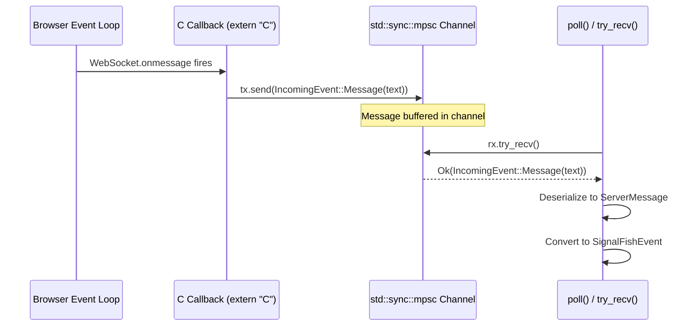

# WebAssembly (WASM)

The Signal Fish Client SDK supports two WebAssembly targets, each serving a
different runtime environment. This guide covers both targets end-to-end:
compilation, transport selection, game-loop integration, and Godot gdext usage.

---

## Overview

| Target | Runtime | Transport | Client | Use Case |
|--------|---------|-----------|--------|----------|
| `wasm32-unknown-unknown` | Browser sandbox / wasm-pack | Bring your own | `SignalFishPollingClient` (with `polling-client` feature) | Generic browser apps, Bevy, wasm-bindgen projects |
| `wasm32-unknown-emscripten` | Emscripten C runtime | `EmscriptenWebSocketTransport` (built-in) | `SignalFishPollingClient` | Godot 4.5 web exports via gdext (godot-rust) |

The two targets differ in what the compiled WASM module can access at runtime.
`wasm32-unknown-unknown` runs inside a pure sandbox with no OS — you must bridge
all I/O through JavaScript. `wasm32-unknown-emscripten` links against
Emscripten's C sysroot, giving native access to browser WebSocket APIs through
Emscripten's C headers.



---

## Target: `wasm32-unknown-unknown`

This is the standard Rust WASM target for browser and wasm-pack projects. It
compiles the SDK's core types — `Transport` trait, protocol types,
`SignalFishEvent`, `SignalFishError`, and `SignalFishConfig` — without pulling in
any transport or async runtime.

### What you get

- All protocol types (`ClientMessage`, `ServerMessage`, payload structs)
- The `Transport` trait definition
- `SignalFishConfig` and `JoinRoomParams` builders
- `SignalFishEvent` and `SignalFishError` enums

### What you do not get

- No built-in transport (WebSocket over TCP is unavailable in the browser sandbox)
- No Tokio runtime (`tokio::net::TcpStream` does not compile to WASM)
- No `SignalFishClient::start()` (requires `tokio::spawn`)

### Building

```sh
rustup target add wasm32-unknown-unknown
cargo build --target wasm32-unknown-unknown --no-default-features
```

!!! warning "Default features must be disabled"
    The default `transport-websocket` feature depends on `tokio-tungstenite`,
    which requires TCP sockets. Always pass `--no-default-features` when building
    for any WASM target.

### Bring your own transport

Implement the `Transport` trait using a browser-compatible WebSocket binding
(e.g., `web-sys`, `gloo-net`, or `wasm-bindgen`). The trait requires three
async methods — `send`, `recv`, and `close` — as documented on the
[Transport](transport.md) page.

### Compatibility

This target is compatible with:

- `wasm-bindgen` / `wasm-pack`
- Bevy (with WASM support)
- Any framework that compiles to `wasm32-unknown-unknown`

---

## Target: `wasm32-unknown-emscripten`

This target provides **full built-in WebSocket support** through the
`EmscriptenWebSocketTransport` and a synchronous polling client
(`SignalFishPollingClient`). It is the recommended path for **Godot 4.5 web
exports via gdext** (godot-rust).

### What you get

- Everything from `wasm32-unknown-unknown`, plus:
- `EmscriptenWebSocketTransport` — browser WebSocket via Emscripten's C API
- `SignalFishPollingClient` — synchronous, game-loop-driven client

### Prerequisites

| Requirement | Version | Notes |
|-------------|---------|-------|
| Rust nightly | latest | Tier 3 target requires nightly toolchain |
| `rust-src` component | (matches nightly) | Required by `-Zbuild-std` to build `std` from source |
| Emscripten SDK | 3.1.74 | Provides the sysroot and system libraries |

### Feature flag

Enable the `transport-websocket-emscripten` feature to access
`EmscriptenWebSocketTransport` and `SignalFishPollingClient`:

```toml
[dependencies]
signal-fish-client = { version = "0.4.0", default-features = false, features = ["transport-websocket-emscripten"] }
```

### Building

```sh
cargo +nightly build -Zbuild-std \
    --target wasm32-unknown-emscripten \
    --no-default-features \
    --features transport-websocket-emscripten
```

!!! note
    The `-Zbuild-std` flag compiles `core`, `alloc`, and `std` from source for
    this tier 3 target. This is why the `rust-src` component is required.

---

## `EmscriptenWebSocketTransport`

A `Transport` implementation backed by Emscripten's built-in
`<emscripten/websocket.h>` C API. It uses raw FFI calls to create a browser
WebSocket and a `std::sync::mpsc` channel to bridge asynchronous C callbacks
into the transport's `recv()` method.

### Construction

```rust,ignore
use signal_fish_client::EmscriptenWebSocketTransport;

let transport = EmscriptenWebSocketTransport::connect("wss://example.com/signal")?;
```

`connect()` is **synchronous** — the WebSocket object is created immediately,
but the connection handshake completes asynchronously in the browser. Messages
sent before the handshake finishes are buffered by the browser.

Returns `Result<EmscriptenWebSocketTransport, SignalFishError>`. On failure the
error is `SignalFishError::Io` (e.g., invalid URL or Emscripten API failure).

### How it works



The callback bridge pattern works as follows:

1. When the WebSocket is created, four C callbacks are registered via
   `emscripten_websocket_set_on*_callback_on_thread()` — for open, message,
   error, and close events.
2. Each callback pushes an `IncomingEvent` onto a `std::sync::mpsc::Sender`.
3. When `recv()` is polled, it calls `try_recv()` on the channel receiver:
    - If a message is available, it returns `Poll::Ready(Some(Ok(text)))`.
    - If no messages are buffered, it returns `std::future::pending()`, which
      yields `Poll::Pending` when polled (it never resolves).

### Threading model

On `wasm32-unknown-emscripten`, everything runs on a **single thread**.
Emscripten WebSocket callbacks fire synchronously on the main thread between
frames. The `Send` bound required by the `Transport` trait is vacuously
satisfied because there are no other threads.

### Compatibility

!!! warning "Polling client only"
    `EmscriptenWebSocketTransport` is designed exclusively for use with
    `SignalFishPollingClient`. It is **not** compatible with
    `SignalFishClient::start()`, which requires a Tokio runtime to spawn a
    background task. The transport's `recv()` uses `std::future::pending()`
    when no messages are buffered — a real async runtime would hang forever
    waiting for a waker that never fires.

### Connection timing

!!! info "Connection timing — `Connected` vs. WebSocket `onopen`"
    `SignalFishPollingClient` emits [`SignalFishEvent::Connected`] on the
    **first call to `poll()`**, not when the browser's WebSocket `onopen`
    callback fires. Because `EmscriptenWebSocketTransport::connect()` returns
    synchronously before the handshake completes, there is a window where
    `Connected` has been delivered but the WebSocket is not yet open.

    Messages sent during this window are **buffered by the browser** and
    delivered once the connection opens — no data is lost. However, callers
    should not interpret `Connected` as proof that the transport handshake is
    complete.

    This differs from the async `SignalFishClient`, where the transport is
    passed to `start()` already connected (e.g., via
    `WebSocketTransport::connect(url).await`), so `Connected` genuinely
    reflects a completed handshake.

---

## `SignalFishPollingClient`

A synchronous, polling-based alternative to `SignalFishClient`. It does **not**
spawn a background task or require an async runtime. Instead, the caller drives
the client by calling `poll()` once per frame from the game loop.

### Construction

```rust,ignore
use signal_fish_client::{
    EmscriptenWebSocketTransport, SignalFishPollingClient, SignalFishConfig,
};

let transport = EmscriptenWebSocketTransport::connect("wss://example.com/signal")?;
let config = SignalFishConfig::new("mb_app_abc123");
let mut client = SignalFishPollingClient::new(transport, config);
```

The constructor immediately queues an `Authenticate` message (just like
`SignalFishClient::start`). The message is sent on the first call to `poll()`.

### Game loop integration

Call `poll()` once per frame. It flushes all queued outgoing commands, drains
all buffered incoming messages from the transport, and returns a `Vec` of
events that occurred during this poll cycle:

```rust,ignore
// In your game loop / _process(delta):
for event in client.poll() {
    match event {
        SignalFishEvent::Authenticated { .. } => {
            client.join_room(JoinRoomParams::new("my-game", "Player1")).ok();
        }
        SignalFishEvent::RoomJoined { room_code, .. } => {
            // You are in the room
        }
        SignalFishEvent::Disconnected { .. } => {
            // Handle disconnection
        }
        _ => {}
    }
}
```

### How `poll()` works internally

`poll()` uses `std::task::Waker::noop()` to create a no-op waker and polls
the transport's async `send()` and `recv()` futures synchronously:

1. Creates a `std::task::Context` with a noop waker.
2. Pops each queued command, serializes it, and polls `transport.send(json)`.
   If the send returns `Pending`, the command is re-queued for the next frame.
3. Loops calling `transport.recv()` and polling the returned future. Each
   `Ready(Some(Ok(text)))` is deserialized into a `ServerMessage`, converted to
   a `SignalFishEvent`, and appended to the output vector. The loop breaks on
   `Pending` (no more buffered messages this frame) or `Ready(None)` (transport
   closed).

### API reference

#### Command methods

All command methods queue a `ClientMessage` for the next `poll()` cycle.
They return `Err(SignalFishError::NotConnected)` if the transport has closed.

| Method | Signature | Description |
|--------|-----------|-------------|
| `poll()` | `fn poll(&mut self) -> Vec<SignalFishEvent>` | Flush sends, drain receives, return events. Call once per frame. |
| `join_room(params)` | `fn join_room(&mut self, params: JoinRoomParams) -> Result<()>` | Join or create a room. |
| `leave_room()` | `fn leave_room(&mut self) -> Result<()>` | Leave the current room. |
| `set_ready()` | `fn set_ready(&mut self) -> Result<()>` | Signal readiness. |
| `send_game_data(data)` | `fn send_game_data(&mut self, data: serde_json::Value) -> Result<()>` | Send JSON game data to other players. |
| `request_authority(flag)` | `fn request_authority(&mut self, become_authority: bool) -> Result<()>` | Request or relinquish authority. |
| `provide_connection_info(info)` | `fn provide_connection_info(&mut self, info: ConnectionInfo) -> Result<()>` | Provide P2P connection info. |
| `reconnect(player_id, room_id, auth_token)` | `fn reconnect(&mut self, player_id: PlayerId, room_id: RoomId, auth_token: String) -> Result<()>` | Reconnect to a room after disconnection. |
| `join_as_spectator(game, room, name)` | `fn join_as_spectator(&mut self, game_name: String, room_code: String, spectator_name: String) -> Result<()>` | Join a room as a spectator. |
| `leave_spectator()` | `fn leave_spectator(&mut self) -> Result<()>` | Leave spectator mode. |
| `ping()` | `fn ping(&mut self) -> Result<()>` | Send a heartbeat ping. |
| `close()` | `fn close(&mut self)` | Close the transport via a single noop-waker poll; see [close lifecycle](client.md#close). |

#### State accessors

All state accessors are synchronous (no `async`, no `Mutex` — single-threaded
environment).

| Method | Signature | Description |
|--------|-----------|-------------|
| `is_connected()` | `fn is_connected(&self) -> bool` | Whether the transport is still alive. |
| `is_authenticated()` | `fn is_authenticated(&self) -> bool` | Whether the server confirmed authentication. |
| `current_player_id()` | `fn current_player_id(&self) -> Option<PlayerId>` | The local player's ID, if assigned. |
| `current_room_id()` | `fn current_room_id(&self) -> Option<RoomId>` | The current room ID, if in a room. |
| `current_room_code()` | `fn current_room_code(&self) -> Option<&str>` | The current room code, if in a room. |

!!! tip "Comparison with `SignalFishClient`"
    `SignalFishPollingClient` mirrors the same API surface as `SignalFishClient`
    but all methods take `&mut self` instead of `&self`, and state accessors are
    synchronous (no `async`). There is no `shutdown()` — use `close()` instead.

---

## Godot Integration Example (gdext)

A complete example showing how to use `SignalFishPollingClient` with
`EmscriptenWebSocketTransport` in a Godot 4.5 gdext Node for web exports.

### Cargo.toml

```toml
[package]
name = "my-godot-game"
version = "0.1.0"
edition = "2021"

[lib]
crate-type = ["cdylib"]

[dependencies]
godot = "0.3"
signal-fish-client = { version = "0.4.0", default-features = false, features = ["transport-websocket-emscripten"] }
serde_json = "1.0"  # Required for send_game_data(serde_json::Value)
```

### GDExtension Node

```rust,ignore
use godot::prelude::*;
use signal_fish_client::{
    EmscriptenWebSocketTransport, JoinRoomParams, SignalFishConfig,
    SignalFishEvent, SignalFishPollingClient,
};

#[derive(GodotClass)]
#[class(base=Node)]
struct SignalFishNode {
    base: Base<Node>,
    client: Option<SignalFishPollingClient<EmscriptenWebSocketTransport>>,
}

#[godot_api]
impl INode for SignalFishNode {
    fn init(base: Base<Node>) -> Self {
        Self {
            base,
            client: None,
        }
    }

    fn ready(&mut self) {
        let transport = EmscriptenWebSocketTransport::connect("wss://example.com/signal")
            .expect("failed to create WebSocket");
        let config = SignalFishConfig::new("mb_app_abc123");
        self.client = Some(SignalFishPollingClient::new(transport, config));
        godot_print!("SignalFish client created");
    }

    fn process(&mut self, _delta: f64) {
        let Some(client) = &mut self.client else { return };

        for event in client.poll() {
            match event {
                SignalFishEvent::Connected => {
                    godot_print!("Connected to Signal Fish server");
                }
                SignalFishEvent::Authenticated { app_name, .. } => {
                    godot_print!("Authenticated as {}", app_name);
                    let params = JoinRoomParams::new("my-game", "GodotPlayer")
                        .with_max_players(4);
                    client.join_room(params).ok();
                }
                SignalFishEvent::RoomJoined { room_code, player_id, .. } => {
                    godot_print!("Joined room {} as {}", room_code, player_id);
                    client.set_ready().ok();
                }
                SignalFishEvent::GameData { from_player, data } => {
                    godot_print!("Game data from {}: {}", from_player, data);
                }
                SignalFishEvent::PlayerJoined { player } => {
                    godot_print!("{} joined the room", player.name);
                }
                SignalFishEvent::PlayerLeft { player_id } => {
                    godot_print!("Player {} left", player_id);
                }
                SignalFishEvent::GameStarting { peer_connections } => {
                    godot_print!("Game starting with {} peers", peer_connections.len());
                }
                SignalFishEvent::Disconnected { reason } => {
                    godot_print!(
                        "Disconnected: {}",
                        reason.as_deref().unwrap_or("unknown")
                    );
                    self.client = None;
                    return;
                }
                _ => {}
            }
        }
    }
}
```

### How it works

1. **`ready()`** — creates the Emscripten WebSocket transport and the polling
   client. Authentication is queued automatically.
2. **`process(delta)`** — called every frame by Godot. Calls `poll()` to flush
   outgoing messages and drain incoming events. Each event is handled inline.
3. **Disconnection** — on `Disconnected`, the client is dropped (`self.client = None`),
   which closes the underlying WebSocket via the transport's `Drop`
   implementation.

---

## Build and Toolchain Setup

Step-by-step instructions for setting up the Emscripten build environment.

### 1. Install Rust nightly and `rust-src`

```sh
rustup toolchain install nightly
rustup component add rust-src --toolchain nightly
```

### 2. Install the Emscripten SDK

```sh
git clone https://github.com/emscripten-core/emsdk.git
cd emsdk
./emsdk install 3.1.74
./emsdk activate 3.1.74
source ./emsdk_env.sh
```

!!! tip
    Add `source /path/to/emsdk/emsdk_env.sh` to your shell profile so the
    Emscripten toolchain is available in every terminal session.

### 3. Verify the build

```sh
# Core types only (no transport)
cargo +nightly build -Zbuild-std \
    --target wasm32-unknown-emscripten \
    --no-default-features

# With Emscripten WebSocket transport
cargo +nightly build -Zbuild-std \
    --target wasm32-unknown-emscripten \
    --no-default-features \
    --features transport-websocket-emscripten
```

Both commands should complete without errors.

### 4. Verify `wasm32-unknown-unknown` (optional)

```sh
rustup target add wasm32-unknown-unknown
cargo build --target wasm32-unknown-unknown --no-default-features
```

### CI configuration

The project's CI verifies both WASM targets on every push to `main` and on
every pull request. See
[`.github/workflows/wasm.yml`](https://github.com/Ambiguous-Interactive/signal-fish-client-rust/blob/main/.github/workflows/wasm.yml)
for the full workflow. Key steps:

| Job | Target | Toolchain | Features |
|-----|--------|-----------|----------|
| `wasm` | `wasm32-unknown-unknown` | stable | `--no-default-features` |
| `emscripten` | `wasm32-unknown-emscripten` | nightly + emsdk 3.1.74 | `--no-default-features`, then `--features transport-websocket-emscripten` |

---

## Feature Flag Reference

| Feature | Default | Description | `wasm32-unknown-unknown` | `wasm32-unknown-emscripten` |
|---------|---------|-------------|:------------------------:|:---------------------------:|
| `transport-websocket` | Yes | WebSocket transport via `tokio-tungstenite` (TCP sockets) | No | No |
| `transport-websocket-emscripten` | No | `EmscriptenWebSocketTransport`; enables `polling-client` | No | Yes |
| `polling-client` | No | `SignalFishPollingClient` — sync, polling-based client for any `Transport` | Yes | Yes |
| `tokio-runtime` | Yes (via `transport-websocket`) | Enables `tokio/rt` and `tokio/time` for background task spawning | No | No |

### Which flags for which target

| Target | Recommended Cargo features |
|--------|---------------------------|
| Native (desktop/server) | `transport-websocket` (default) |
| `wasm32-unknown-unknown` | `--no-default-features` (bring your own transport) |
| `wasm32-unknown-emscripten` | `--no-default-features --features transport-websocket-emscripten` |

!!! warning "Feature conflicts"
    Do not enable `transport-websocket` or `tokio-runtime` when targeting any
    WASM target. They depend on `tokio::net::TcpStream` and Tokio's
    multi-threaded runtime, which do not compile to WebAssembly.

---

## Troubleshooting / FAQ

### Missing Emscripten SDK

**Error:**

```text
error: linker `emcc` not found
```

**Solution:** Install and activate the Emscripten SDK (version 3.1.74), then
source `emsdk_env.sh` before building. See
[Build and Toolchain Setup](#build-and-toolchain-setup).

---

### Wrong target triple

**Error:**

```text
error[E0432]: unresolved import `crate::transports::emscripten_websocket`
```

**Solution:** You are building for `wasm32-unknown-unknown` with the
`transport-websocket-emscripten` feature enabled. This feature is only available
on `wasm32-unknown-emscripten`. Switch to the correct target:

```sh
cargo +nightly build -Zbuild-std \
    --target wasm32-unknown-emscripten \
    --no-default-features \
    --features transport-websocket-emscripten
```

---

### Missing `rust-src` component

**Error:**

```text
error: the `-Zbuild-std` flag requires the `rust-src` component
```

**Solution:**

```sh
rustup component add rust-src --toolchain nightly
```

---

### `SignalFishClient::start()` does not work with Emscripten

**Symptom:** The application compiles but hangs or panics at runtime when
calling `SignalFishClient::start()` on `wasm32-unknown-emscripten`.

**Explanation:** `SignalFishClient::start()` requires the `tokio-runtime`
feature to spawn a background task via `tokio::spawn`. Tokio's runtime is not
available on Emscripten. Even if compilation succeeded (e.g., with stubs), the
runtime would not function.

**Solution:** Use `SignalFishPollingClient` instead. It drives the transport
synchronously via `poll()` and does not require any async runtime:

```rust,ignore
let mut client = SignalFishPollingClient::new(transport, config);

// In your game loop:
let events = client.poll();
```

---

### `recv()` never returns on Emscripten

**Symptom:** Awaiting `transport.recv()` from a real async executor hangs
indefinitely.

**Explanation:** When no messages are buffered, `EmscriptenWebSocketTransport::recv()`
returns `std::future::pending()`. This future never resolves because there is no
waker to notify — Emscripten callbacks push to a `std::sync::mpsc` channel that
has no waker integration.

**Solution:** Use `SignalFishPollingClient::poll()`, which polls the future with
a noop waker and correctly handles the `Pending` result by breaking out of the
receive loop until the next frame.

---

### `uuid` crate errors on WASM

**Symptom:** Compilation errors related to `uuid::Uuid::new_v4()` or random
number generation on WASM targets.

**Explanation:** The `uuid` crate needs the `"js"` feature to use
`getrandom` via `wasm-bindgen` on `wasm32` targets.

**Solution:** This is already handled in the SDK's `Cargo.toml`:

```toml
[target.'cfg(target_arch = "wasm32")'.dependencies]
uuid = { version = "1", features = ["v4", "serde", "js"] }
```

No action is needed when using the SDK as a dependency. If you use the `uuid`
crate directly in your own code, add the `"js"` feature for WASM targets.

---

### MSRV vs. nightly requirement

The SDK's MSRV is **1.85.0** for native targets. However, the
`wasm32-unknown-emscripten` target requires **Rust nightly** because:

1. It is a tier 3 target — pre-built `std` is not available on stable.
2. The `-Zbuild-std` flag is a nightly-only feature.

The `wasm32-unknown-unknown` target works with **stable Rust 1.85.0+** (no
`-Zbuild-std` needed; pre-built `std` is available via `rustup target add`).

---

## Architecture Deep Dive

### End-to-end data flow

This diagram traces a complete round-trip from the Godot game loop through the
Emscripten transport to the browser WebSocket and back:



### The callback bridge pattern

The central design challenge on Emscripten is bridging **asynchronous C
callbacks** (fired by the browser event loop) into **synchronous Rust code**
(called from the game loop). The SDK solves this with a `std::sync::mpsc`
channel:

1. **Registration** — `EmscriptenWebSocketTransport::connect()` creates a
   `CallbackState` struct containing the channel's `Sender` and passes a raw
   pointer to Emscripten's callback registration functions.

2. **Callback invocation** — when the browser fires a WebSocket event (open,
   message, error, close), the corresponding `extern "C"` function converts the
   raw pointer back to `&CallbackState` and pushes an `IncomingEvent` onto the
   channel.

3. **Consumption** — `recv()` calls `try_recv()` on the channel's `Receiver`.
   If a message is available, it returns immediately. If the channel is empty,
   it returns `std::future::pending()`, which the polling client handles by
   breaking out of the receive loop.

4. **Cleanup** — on `Drop`, the transport calls `emscripten_websocket_close()`
   and `emscripten_websocket_delete()` (which unregisters all callbacks), then
   reclaims the `CallbackState` via `Box::from_raw`. The ordering ensures no
   callback can fire after the state is freed.



!!! note
    The `std::sync::mpsc` channel is safe here because `wasm32-unknown-emscripten`
    is single-threaded. The "send" from the C callback and the "receive" from
    `poll()` never execute concurrently — they interleave on the same thread
    between browser event loop ticks and game frames.
